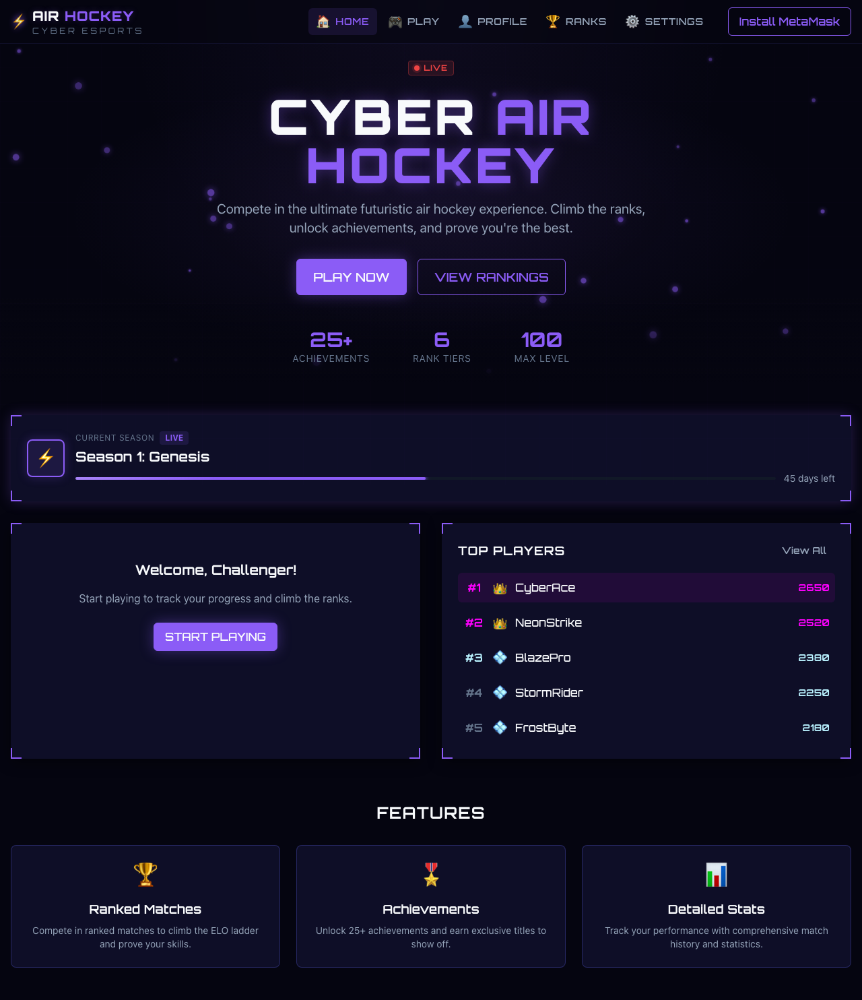
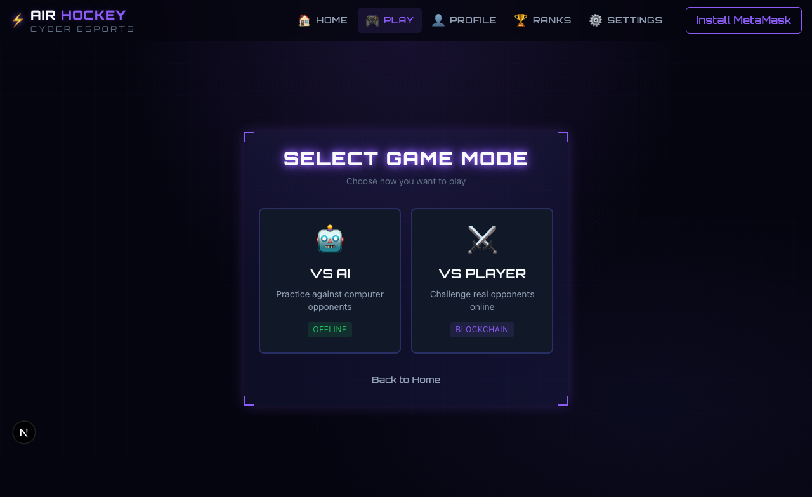
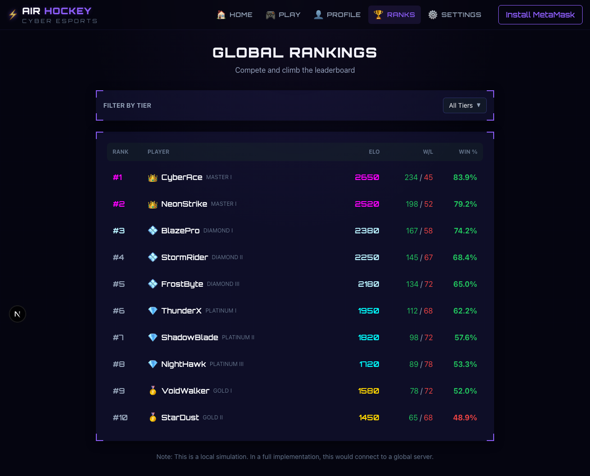

# Cyber Air Hockey — Multiplayer Web3 Esports Game

Real-time air hockey with ELO rankings, on-chain match records, and a full esports layer.

[](https://www.typescriptlang.org/)
[](https://nextjs.org/)
[](https://developer.mozilla.org/en-US/docs/Web/API/WebSockets_API)
[](LICENSE)



## Live Demo

**[cyber-air-hockey.vercel.app](https://cyber-air-hockey.vercel.app)**

---

## What Is Cyber Air Hockey?

Browser-based air hockey with a full competitive structure built on top. ELO rating system, 6 rank tiers, seasonal leaderboards, 25+ achievements, and match results verified on-chain via MetaMask. Play against the AI offline or find opponents over WebSocket.

---

## Screenshots

| Game Modes | Global Rankings |
|-----------|----------------|
|  |  |

---

## Features

- **Real-time multiplayer**: WebSocket physics engine (Matter.js) with low-latency game state sync
- **ELO rating system**: 6 rank tiers from Bronze to Master with skill-based matchmaking
- **On-chain match records**: Match results verified via MetaMask wallet
- **VS AI mode**: Offline play against computer opponents
- **Season system**: Live competitive seasons with seasonal leaderboards
- **Achievements**: 25+ unlockable titles and badges
- **Player profiles**: Stats, match history, win rates, and rank progression

---

## Tech Stack

| Layer | Technology |
|-------|-----------|
| Frontend | Next.js 16, TypeScript, Tailwind CSS |
| Game Physics | Matter.js |
| Multiplayer | WebSocket (Node.js server) |
| Blockchain | MetaMask, Ethereum/EVM smart contracts |
| State | Zustand |
| Deployment | Vercel (frontend), Railway (WebSocket server) |

---

## How It Works

```
Player connects
      |
      v
Choose mode: VS AI (offline) or VS Player (online)
      |
      +-- VS AI: physics runs client-side (Matter.js)
      |
      +-- VS Player:
            |
            v
         WebSocket server matches opponents
            |
            v
         Real-time game state sync
            |
            v
         Match result signed and recorded on-chain
```

---

## Running Locally

```bash
git clone https://github.com/dmz4pf/cyber-air-hockey.git
cd cyber-air-hockey
npm install
npm run dev
```

For multiplayer (optional):
```bash
cd server && npm install && npm run dev
```

---

## Project Structure

```
cyber-air-hockey/
├── src/
│   ├── app/
│   │   └── (cyber)/
│   │       ├── game/        # Game canvas and physics
│   │       ├── leaderboard/ # Global ELO rankings
│   │       ├── profile/     # Player stats
│   │       └── settings/    # Account settings
│   └── components/cyber/    # UI components
├── server/                  # Node.js WebSocket server
│   └── src/
│       ├── roomManager.ts   # Matchmaking and game rooms
│       └── index.ts         # WS server entry
└── contracts/               # On-chain match verification
```

---

## License

MIT
